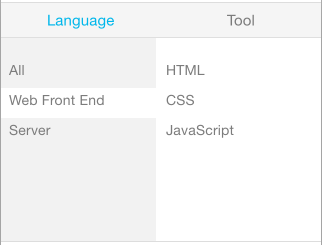

# react-native-tab
react-native-tab is a simple module for add a "Tab Menu" to your React Native app.

### Features
       
       

### Usage
##### Demo1:

    var data = {
      "Language": {
        "All": ["All"],
        "Web Front End": [
          "HTML",
          "CSS",
          "JavaScript"
        ],
        "Server": [
          "Node.js",
          "PHP",
          "Python",
          "Ruby"
        ]
      },
      "Tool":{
        "All": ["All"],
        "Apple": ["Xcode"],
        "Other": ["Sublime Text", "WebStrom",]
      }
    };
    
    
    var App = React.createClass({
      render: function(){
        return (
          <View style={{marginTop:25}}>
            <MenuList data={data} nSelected={1} tabSelected={0} click={this.onPress}/>
          </View>
        );
      },
      onPress: function(val){
        alert(val);
      }
    });
    
    
    AppRegistry.registerComponent('app', () => App);

##### Demo2:

    var React = require('react-native');
    var MenuList = require('./../tab');
    
    var {
      AppRegistry,
      StyleSheet,
      Text,
      View,
      ScrollView,
      TouchableOpacity,
    } = React;
    
    var data = {
      "全部区域": {
        "全部区域": ["全部区域"],
        "热门商圈": [
          "虹桥地区",
          "徐家汇地区",
          "淮海路商业区",
          "静安寺地区",
          "上海火车站地区",
          "浦东陆家嘴金融贸易区",
          "四川北路商业区",
          "人民广场地区",
          "南翔、安亭汽车城"
        ],
        "热门行政区": [
          "静安区",
          "徐汇区",
          "长宁区",
          "黄埔区",
          "虹口区",
          "宝山区",
          "闸北区"
        ]
      },
      "地铁沿线":{
        "地铁全线": ["地铁全线"],
        "一号线": ["莘庄站", "外环路站", "莲花路站", "锦江乐园站", "上海南站站", "漕宝路站"],
        "二号线": ["浦东国际机场站", "海天三路站", "远东大道站", "凌空路站"]
      }
    };
    
    
    var App = React.createClass({
      render: function(){
        return (
          <View style={{marginTop:25}}>
            <MenuList data={data} nSelected={1} tabSelected={0} click={this.onPress}/>
          </View>
        );
      },
      onPress: function(val){
        alert(val);
      }
    });
    
    
    AppRegistry.registerComponent('app', () => App);

### Properties
    
+ data: 你需要渲染的数据，格式参见demo。
+ tabSelected: 默认选中第几个tab，number类型。
+ nSelected: 默认选中tab下的二级菜单项，number类型。